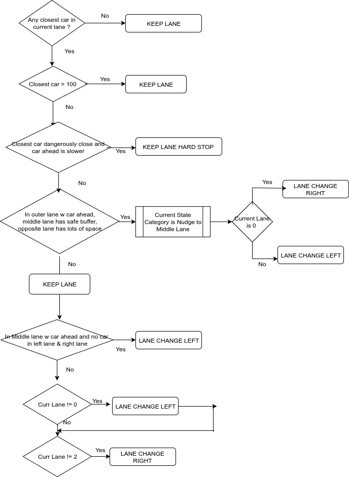

# CarND-Path-Planning-Project
Self-Driving Car Engineer Nanodegree Program
   
## Approach
1. Compute Trajectory using splines derived from map waypoints
   * Spline fitting to map waypoints from s to x,y,dx,dy
   * Smoothing 
2. Behavioral Planning
   * States Used
   * Behavior Plan for Next State Transitions
3. Trajectories Generation and Evaluation
   * Jerk Minimization Trajectories
   * Cost Functions
   * Cost Weights
 
---
#### Basic Build Instructions

2. Make a build directory: `mkdir build && cd build`
3. Compile: `cmake .. && make`
4. Run it: `./path_planning`.

#### Files submitted

###### **_Vehicle.h_ _Vehicle.cpp_**
Model of a car tracking its current position, velocity and acceleration in Frenet coordinates. Also store forecasted position, velocity and acceleration for use after update interval.

###### **_PTG.h_ _PTG.cpp_** 
Polynomial Trajectory Generator and Behavioral model. Given the current state of the car and the sensor fusion data, evaluate next states, compute proposed trajectories and their evaluated costs. Return the minimum cost trajectory.

###### **_main.cpp_**               
Computes trajectory based on splines using waypoints.

---
### 1. Trajectory Computation using Splines

**_Based on guidance by Marcus Erbar on discussions.udacity.com and on slack channel #p-path-planning
https://discussions.udacity.com/t/latency-handling/322156/18_**

**To define a path made of `kMaxNumStepsAhead` (x,y) points that the car will visit sequentially every 0.02 seconds.**

* We will first do our computations by converting the car's (and other car's) locations into Frenet space `(s, d)`.

##### Generating a set of local splines for `x,y,dx,dy` trajectories. **(`getLocalizedSplineSegments`)**
* First select map waypoints close to the location of the car. As per Marcus E's recommendation we select 9 waypoints behind and 15 waypoints ahead. First we compute the corresponding map indices corresponding to these waypoints (note that these might wrap around) and then use those indices to retrieve the corresponding s, x, y, dx and dy.

    ###### Localization **`(get_local_s)`**
    * We compute a vector of local `s` correponding to the waypoints selected. This local `s` starts at 0 for the first point waypoint selected. Subsequent local s's are the offsets of the other `s` waypoints from this first s waypoint.
    * Note the `local_s` the car is not zero since it is not the reference point, but its s is also localized on the basis of the first local s.
    * The `sensor_fusion` parameters are also correspondingly localized relative to that first local s. 


* The splines for corresponding `x,y,dx,dy` are are then computed as fitting them on the basis of these "offset" local s's.
* Now that we have the splines based on the local s we can use them subsequently to re-transform them back from computed `s,d` back to `x,y` using `generate_xy_from_sd`

##### Using splines and smoothing function to minimize sharp corners and generate x,y **(`generate_xy_from_sd`)**
* (As per guidance from Marcus.Erbar) First re-use previous path points (around 15) to populate the new-path. Then instead of directly using the spline function to compute the corresponding (x, y) - start with a previous (x,y) , compute the difference between the computed spline and the previous point and add it to the previous point to build the path. 

* `main.cpp` routine then invokes Polynomial Trajectory Generator class `PTG`'s `generate_sd_path` based on the *localized* cars location in frenet coordinates and the relative location of the other cars.We will see in the next section how we utilize behavioral planning to generate the said s,d trajectory.

We also estimate and forecast from the from the calculated (s,d) trajectory the future frenet s_velocity and s_acceleration and d_velocity and d_acceleration. This is done by taking three points after an `update_interval` (40 points, 1 sec), compute the distance between the first two points and using that to compute velocity. Similary by computing the relative velocity between points 1,2 and 2,3 we can forecast acceleration in s,d. To simplify things, we normalize our computations in terms of unit time-step of 0.02 secs.

---
### 2. Behavioral Planning


##### States Used

For Behavior Planning, we have the following states:

* KEEP LANE
* KEEP LANE HARD STOP AHEAD
* LANE CHANGE LEFT
* LANE CHANGE RIGHT

The logic for evaluating potential next-states `get_next_state_trajectories` and whether we will evaluate lane changes is illustrated in the following flow-chart. Essentially if the car has no car ahead of it or at a safe distance, it keeps its lane. Buf if there are cars ahead of it, it looks at the other lane populations (mostly ahead and sometimes behind) and their corresponding speeds to decide if it needs to change lane.

Note that we are careful when changing lanes or following car and if there is a car-ahead we `follow_leader` and adjust our velocity to match leaders.

In addition to KEEP LANE we also have a safety state KEEP LANE HARD STOP AHEAD, when faced with a car that is very close ahead, is slowing down dangerously - red lights blinking. We *do not* even consider changing lanes in this aspect, because we will exceed our jerk. We slow down to match the car ahead. We reduce the `num_points_aheads` from our normally long trajectory and re-compute the trajectory for keep lane.

We also have logic that when in an outer-most lane with a car ahead, mid-lane populated but with safe available room, but opposite lane with lots of available room, we nudge the car to do a lane change to the mid-lane which we would not normally do given the population of the middle lane.

In addition if we are in the middle lane with a car ahead, and we have available lanes right and left, we choose to pass on the left as we should.

We `push-back` the states for LANE_CHANGE, LANE_CHANGE_RIGHT (unless we are in the rightmost lane), LANE_CHANGE_LEFT(unless we are in the leftmost lane) for evaluation.


 
For each prospective `next_state` we realize a set of prospective trajectories `all_goals`. Based on the `next_state` we realize the set of prospective trajectories based on our target/end `goal_vec`.

```
 for (auto state : next_states)  {
    switch (state) {
    case KEEP_LANE:
      realize_keep_lane_state_trajectories(cur_lane_i, follow_leader, start_s, lead_s, vehicles, all_goals);
      break;      
    case KEEP_LANE_HARD_STOP_AHEAD:
      realize_hard_stop_state_trajectories(cur_lane_i, follow_leader, start_s, lead_s, vehicles, all_goals);
      break;      
    case LANE_CHANGE_LEFT:
      realize_lane_change_left_trajectories(cur_lane_i, follow_leader, start_s, lead_s, vehicles, all_goals);
      break;
    case LANE_CHANGE_RIGHT:
      realize_lane_change_right_trajectories(cur_lane_i, follow_leader, start_s, lead_s, vehicles, all_goals);
      break;
    default:;
    }
  }


```

How will we generate the trajectories ? How will we then evaluate the corresponding trajectories ? We discuss this next.

---
### 2. Trajectories: Generation and  Evaluation

#### Trajectory Generation
Now that we have our goal points for our prospective trajectories, `generate_sd_path` then proceeds to create the **JERK MINIMIZATION TRAJECTORIES** for the computed goals.  The function `jmt` returns the jerk minimizing polynomial coefficients for `(s, d)`  which we will use to evaluate them. 

#### Trajectory Evaluation using cost minimization

As discussed in our lectures we have two categories of costs that we compute in `calculate_cost`:
* **INFEASIBLE COSTS**    - binary functions that return 1 or 0 covering feasibility
* **EVERYTHING ELSE **    - mostly a sigmoid function of absolute magnitude that graduates from 0 to 1.

The **INFEASIBLE COSTS** are assigned very high weight 999999. They are
    * exceeds_speed_limit_cost
    * exceeds_accel_cost
    * exceeds_jerk_cost
    * collision_cost

Once infeasible costs are encountered they are just returned with 999999.

The other costs and their corresponding weights are :

```
  std::map<std::string, double> _cost_weights = {
     {"lane_selection_cost",  30.0}, 
     {"buffer_cost",         190.0},
     {"eff_cost",            110.0}, 
     {"tot_acc_s_cost",       30.0},
     {"tot_acc_d_cost",       20.0},
     {"tot_jerk_cost",        10.0},
   }; 
```

We give very high weights to make sure that the cars have sufficient buffer-lengths between them and cars in front and behind.

`lane_selection_cost` takes a proactive stance towards selecting the most appropriate lane. It looks ahead and first checks if traffic in planned lane is slower than the current ahead car, it imposes a high cost. Also for a planned lane change if there is a car coming from behind and there is not sufficient room we again impose a very high cost. Otherwise the cost returned is the logistic of (1 minus the difference of the car ahead in the target lane and the current car lane).

The sum of other costs is then returned and the calling function evaluates the minimum cost and returns the corresponding trajectory coefficients to evaluate the optimal trajectory in `(s, d)` in `generate_sd_path`.

## Vehicle successfully navigating the track with above settings.

[Video of Car Navigating the track more than the rubric requirements]
https://youtu.be/ttTLCWQcIsU
